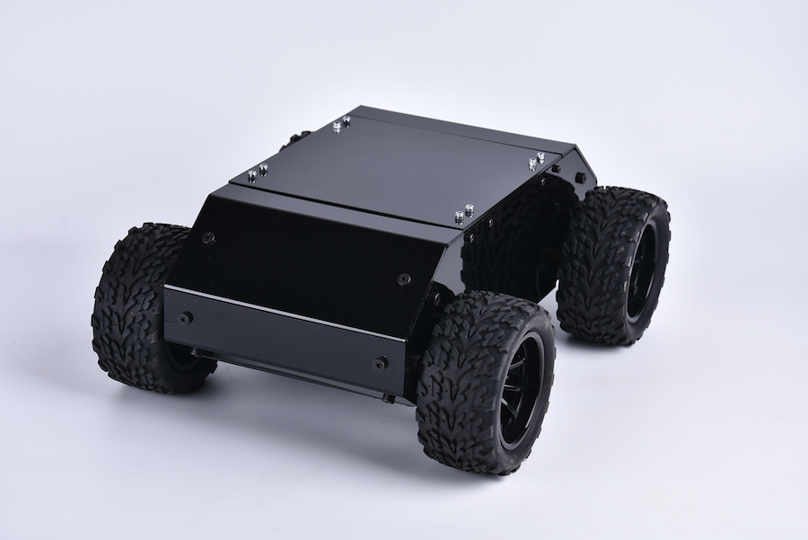

# 组装测试

**注意：**

由于Autolabor2.5无雷达版出厂SD卡默认为Autolabor OS SD卡镜像(雷达版)，用户收货后需重新烧写Autolabor OS SD卡镜像(无雷达版)。

[镜像下载](http://192.144.142.81/autolabor2release20170510-raspberry3-ros-indigo.7z) / [SD卡烧写教程](sd)

收到机器人后,首先请按照视频进行组装,并使用手机App测试，手机App可以正常遥控机器人代表硬件与软件运行正常.

[手机App下载](http://download.autolabor.com.cn/app/autolabor2-mobilecontroller-v1.apk)

<iframe frameborder="0" width="640" height="498" src="https://v.qq.com/txp/iframe/player.html?vid=y0506dtsi6f&tiny=0&auto=0" allowfullscreen></iframe>

# 熟悉软件环境

当机器人启动后,会自动建立一个名为autolabor的WIFI热点.此WIFI没有密码,您可以使用电脑直接连接到此WIFI网络上.

接下来您需要一个终端工具软件,连接到树莓派的Linux系统里.任何终端工具都可以,如果您使用Linux/Mac系统可以直接利用系统自带的SSH命令.如果您的电脑运行在Windows环境下,可以采用[Putty](https://www.putty.org/)等工具

工具使用方法可以参考

[SSH使用说明](http://www.ruanyifeng.com/blog/2011/12/ssh_remote_login.html)

[Putty使用说明](https://www.vpser.net/other/putty-ssh-linux-vps.html)

下面以SSH为例,介绍连接机器人方法:

当机器人开机之后,会自动新建一个名为 autolabor的热点.

连接到此热点的设备将会被自动分配IP.

autolabor 机器人默认的IP是 192.168.1.1 

用户名 pi 

密码 raspberry

可以通过SSH用以下命令连接到autolabor的Linux系统.

```
ssh pi@192.168.1.1
```

输入登陆密码 raspberry

登陆成功后可以通过如下指令切换到root目录

```
sudo su-
```

# 启动介绍

###  默认启动脚本

默认情况下Linux系统在启动后会执行脚本 /etc/rc.local 里的内容.

输入如下命令,可以对此脚本进行编辑.

```
vim /etc/rc.local
```

打开后我们可以看到最后几行如下

```
cd /root
./startautolabor.sh
```

startautolabor.sh 是 Autolabor的自动启动脚本,该脚本的内容如下.

```
source /opt/ros/indigo/setup.bash
export ROS_MASTER_URI=http://192.168.1.1:11311/
export ROS_IP=192.168.1.1 
roslaunch /opt/ros/indigo/share/rosbridge_server
/launch/rosbridge_websocket.launch
```
其中第二行和第三行配置了ROS MASTER的IP地址和本机IP地址.

最后一行启动了 rosbridge_websocket.launch 文件,这个文件内配置的节点实现控制底盘和手机通讯的功能.

如果您想用自己的启动脚本替换, 可以在rc.local文件中用#注释掉Autolabor启动脚本,增加您自己的启动脚本

例如将rc.local 尾部修改为:

```
cd /root
#./startautolabor.sh
myrobot.sh
```
当然您也可以根据需要修改startautolabor.sh的内容,例如替换成自己需要的IP地址,执行自己需要的launch文件.

### 默认roslaunch文件

在rosbridge_websocket.launch文件中,默认配置了两个节点,分别是

```
ros_arduino_python

rosbridge_websocket

```

其中ros\_arduino\_python负责与下位机Arduino通讯,将cmd\_vel指令转化为Arduino需要的PID指令,从而控制马达以指定速度旋转.同时会读取Arduino提供的编码器数据,向ROS系统发布里程计数据.

rosbridge\_websocket是实现手机遥控的核心部件,它负责实现手机端与ros系统的通讯功能.

当手机端需要订阅某个topic时,会通过websocket像rosbridge\_websocket发起订阅的申请, 由rosbridge向其通知ros系统内部topic新的消息. 

rosbridge 可以通过tcp udp 和 websocket 通讯, autolabor2.5无雷达版使用的websocket的实现方式.

有关rosbridge的内容详情可以参考 [rosbridge_suite 文档](http://wiki.ros.org/rosbridge_suite)

有关ros\_arduino\_python的配置,可以参考其[官网](http://wiki.ros.org/ros_arduino_python)