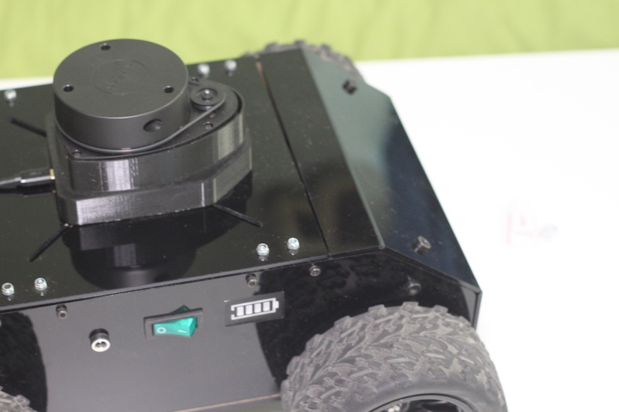
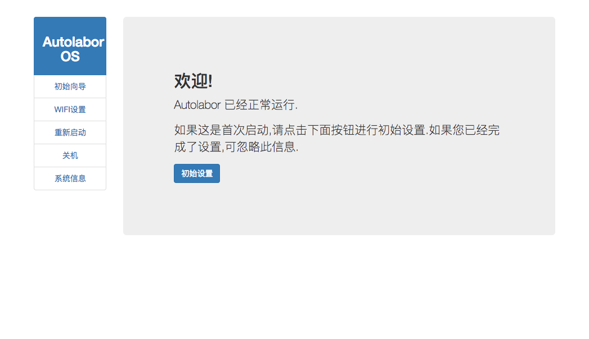

# 清点零件

当您收到Autolabor2.5后,请首先清点包裹零部件 包裹内应包含

名称 | 数量   
--- | ---
车体 |  1个
轮胎 |  4个
激光雷达 |  1个
激光雷达底座 | 1个
盖板 | 1个
充电器 | 1个
SD卡 | 1个
读卡器 | 1个
工具 | 1套

本激光雷达已经与底座盖板组装好
如果您发现零件有缺失,请及时联系客服补发

确认零件数量无误后,开始组装过程

# 产品组装

1、安装轮胎

将轮胎套入车轴后,利用附带的六角扳手锁紧联轴器. 如下图


2、安装SD卡

随机会附带1张SD卡和1个读卡器,在蓝色袋子中.其中SD卡已经烧录好最新版本AutolaborOS,我们将卡安装到机器人内的树莓派上


注意SD卡金属面向上


安装好如下图


3、组装雷达

使用随机附带的螺丝(在雷达的背面),将雷达和面板安装在一起

注意雷达马达所在方向为正方向,尾部USB线指向过线槽


反面


4、安装面板

将雷达组装好后,将USB插在树莓派USB插口上


然后将盖板扣上,注意将雷达正方向对齐车体正方向,否则导航功能会出现异常



# 初始配置

将烧录好的SD卡,插入Autolabor机器人的树莓派中,打开电源.

此刻您将发现一个名为Autolabor的无线网络


此WIFI并未设置密码,请连接到此网络.

打开浏览器,在地址栏输入 http://192.168.2.1/

您将看到AutolaborOS的管理界面.



点击初始设置按钮,进行初次设置.

整个初始过程可跟随提示一步步进行.

需要特别指出的是,请确保正确产品型号和网络设置正确.

否则可能出现无法再连接到机器人的现象.

一旦出现此问题,可参考 常见问题/无法看到热点

完成初始化设置后，机器人会重新启动

# 快速上手

## APP控制

[下载 Autolabor Remote APP(雷达版)](http://www.autolabor.com.cn/download)

打开APP

只要手机与机器人处于同一局域网络,App就会发现机器人,并显示其IP地址


导航功能启动会花费一定时间，请耐心等待。


在使用完毕机器人后，不要直接关闭电源，直接关闭电源的行为可能导致SD卡文件系统损坏，之后无法正常使用。  

正确的关闭方法：

在App中，点击关机按钮，等待雷达停止旋转后，关闭电源开关。

## SLAM导航

### 准备环境

RVIZ&SLAM导航需要 linux系统 和 ROS环境。没有相应环境的用户，可以按照下方视频教程在虚拟机中安装AutolaborOS(amd64)。

#### 虚拟机安装

VirtualBox虚拟机下载安装

[下载 VirtualBox虚拟机](http://www.autolabor.com.cn/download)

<iframe frameborder="0" width="640" height="360" src="http://www.autolabor.com.cn/lib/video/docplay/3" allowfullscreen></iframe>

#### AutolaborOS安装

虚拟机中安装AutolaborOS

<iframe frameborder="0" width="640" height="360" src="http://www.autolabor.com.cn/lib/video/docplay/4" allowfullscreen></iframe>

### SSH远程连接

SSH远程访问前，需要获取小车的ip地址

1.热点模式： 机器人默认的IP是 192.168.2.1
2.WIFI/路由器模式：使用app获取

用户名 autolabor 

密码 autolabor

可以通过SSH用以下命令连接到autolabor的Linux系统.

```
ssh autolabor@192.168.2.1
```

输入登陆密码 autolabor

登陆成功后可以通过如下指令切换到root目录

```
sudo su-
```

<iframe frameborder="0" width="640" height="360" src="http://www.autolabor.com.cn/lib/video/docplay/5" allowfullscreen></iframe>

### SLAM&RVIZ

<iframe frameborder="0" width="640" height="360" src="http://www.autolabor.com.cn/lib/video/docplay/6" allowfullscreen></iframe>

在使用完毕机器人后，不要直接关闭电源，直接关闭电源的行为可能导致SD卡文件系统损坏，之后无法正常使用。

正确的关闭方法：
输入命令 sudo poweroff，等待雷达停止旋转后，关闭电源开关。

