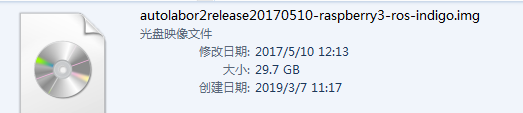
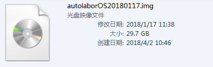
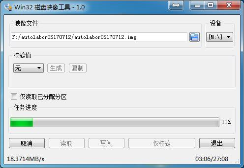
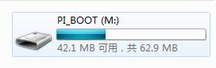
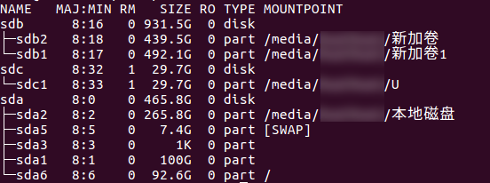
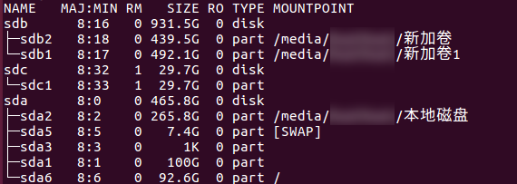
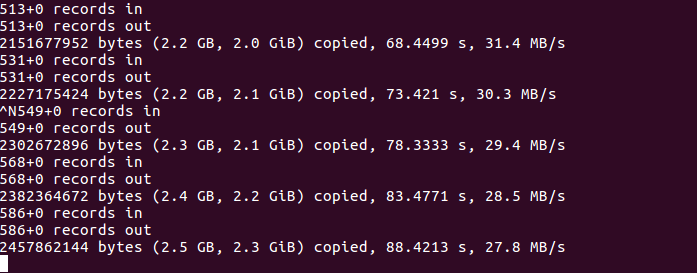
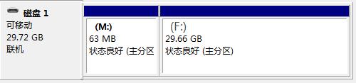
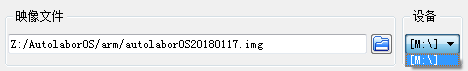

# 下载镜像文件

首先到[下载](http://www.autolabor.com.cn/download)最新版本Autolabor OS SD卡镜像(根据是否会使用雷达，选择雷达版或无雷达版)，然后用支持7z格式的压缩工具解压到硬盘，得到一个29.7G（windows系统）的img文件。




注：请确保解压完全

# 烧录SD卡

准备好随机附带的白色SD卡，利用烧录软件将镜像文件烧录进去.

注意：如果随机附带SD卡丢失，最好购买与原机相同SD卡，或者容量大于32G的SD卡，否则可能会由于容量不足烧录失败.

## Windows操作系统

如果您使用Windows操作系统，推荐使用 [win32diskimager](https://sourceforge.net/projects/win32diskimager/) 进行烧录。

如发生读卡器插上电脑后，读取出了2个盘，见下方常见问题解决。


点击写入，烧录成功后：




如果您使用Linux/OSX操作系统，可使用内置工具dd进行烧录.

## Linux操作系统

* 准备SD卡
* 打开命令窗口，su切换到root用户
* 下载7zip软件包（已经安装过的可省略此步）

		apt-get install p7zip-full

* 进入到镜像文件所在文件

		cd /home/…

* 在当前目录解压镜像文件

		7za x autolaborOS170712.7z -r -o./

* 查看SD卡，在往里写入数据前，先将SD卡取消挂载，避免在写入的时候对其进行了操作，影响烧录（已经取消挂载的，可省略此步）
	* 查看硬盘信息

			lsblk

		

		可以看到SD卡相关信息，路径为/dev/sdc，挂载地址为/media/xxx/U

	* 取消挂载

			umount /dev/sdc1

* 再次查看硬盘信息，可以看到SD卡后没有挂载目录信息，即取消挂载成功

		lsblk

	

* 开始烧录

		dd bs=4M if=/home/…/autolaborOS170712.img of=/dev/sdc

	if是镜像路径，of是写入SD卡路径，【写入路径一定要仔细确认，如果路径错误，就把别的硬盘给洗了，此操作不可恢复】	在烧录的过程中，不要操作该窗口，避免烧录过程停止

* 新开一个窗口(ctrl+alt+T)，root用户查看烧录进度

		su
		watch -n 5 killall -USR1 dd

	

* 完成烧录

## OSX操作系统

把ISO镜像转换为一个可启动的USB设备。一种可行的方法是通过OS X的Terminal “浇灌”到目标卷中。

这的注意的是：用Mac OS X 用户账户会有一些提示，这时用 sudo su 登入 root 或者 sudo ［commond］。

还有一点是记得备份你USB驱动器的内容，因为这会擦除你的USB驱动器。预先准备，转换iso成dmg

```
hdiutil convert -format UDRW -o ~/linux.dmg /tmp/linux.iso

```

1、diskutil list

2、卸载目标驱动器

```
sudo umount /dev/(IDENTIFIER)    ==>  IDENTIFIER 为目标驱动器标志符（卷标）

```

```
我的U盘卷标为disk2s1  执行 ==> sudo umount /dev/disk2s1

```

3、浇灌

```
sudo dd if=源路径  of=/dev/r卷标  bs=1m      ［‘r’  会让命令执行加快一点］ ［‘bs’ 为一次填充的容量］

```

```
sudo dd if=~/Desktop/Windows10_x64_EN-US.iso of=/dev/rdisk3s2  bs=1m

```

4、等待...

5、完成后 弹出

```
diskutil eject /dev/(IDENTIFIER) ［‘IDENTIFIER’为卷标］

```

# 常见问题

##### 读卡器插上电脑后，读取出了2个盘，两个设备的空间都不够，应该选择哪个设备烧系统

操作：

1. 右键电脑->管理->磁盘管理
	
2. 选择分区，右键删除所有卷
3. 新建卷->格式化卷（默认配置）
4. 得到一个29.7G的盘
	
