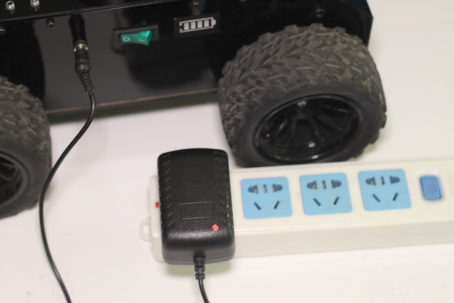
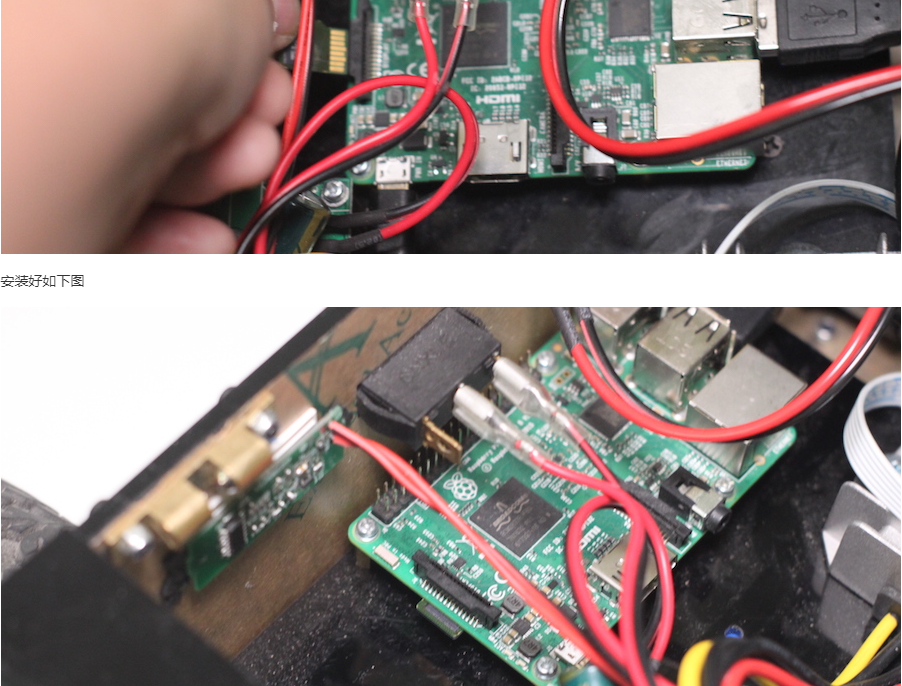

### 目录

1. 关机
2. 充电
3. 雷达不旋转
4. 无法看到热点
5. 【autolabor】WIFI密码
6. ssh连接工具
7. 账户登录信息
8. 如何进行ssh远程连接
9. 如何让机器人上网/接入互联网
10. APP打开后一直显示 【查找Autolabor机器人…】
11. APP一直显示【等待接收地图…】
12. 电量正常，打开电源后雷达正常转动，ping 192.168.2.1能ping通，但浏览器(192.168.2.1)无法进入页面
13. 使用虚拟机无法ssh连接成功
14. 如何恢复出厂系统/烧卡
15. 将机器人网络设置成了【接入无线路由】模式，但路由器是手机，但现在手机不在身边，如何改回初始设置
16. 电脑端APP无法操作/控制小车
17. SD卡烧写完毕，插卡通电后找不到【autolabor】WIFI

***

##### 1、关机

务必不要直接关闭开关

您可以用两种方式进行关机。

1. 点击App中关机按钮

2. 登陆到机器人系统，使用 sudo poweroff 指令

待雷达停止转动后，再关闭电源开关。

直接关闭电源开关可能导致SD卡内容损坏。

##### 2、充电

将充电器插头插入小车右侧插口，充电器插入插座即可充电

充电指示灯为红色表明当前正在充电中，绿色代表已经充满。(未插好也为绿色)

注意尽量关机后充电，2-3小时电池可以充满， 充满后可以正常使用2-3小时。



##### 3、雷达不旋转

如果开机后雷达不旋转，请进行如下检查

检查雷达USB连接线是否已经插在树莓派USB口上。

检查是否已经插好SD卡(金属面向上)

##### 4、无法看到热点

用一根网线将机器人与路由器相连,在同一个局域网的PC中，运行遥控程序，看是否能发现机器人。

如果可以，通过浏览器访问机器人IP重新进行初始化设置。

如果仍然无法发现机器人，请尝试重新烧录SD卡，并重复初始设置过程。

##### 5、【autolabor】WIFI密码

autolabor

##### 6、ssh连接工具

任何终端工具都可，如果您使用Linux/Mac系统可以直接利用系统自带的SSH命令。如果您的电脑运行在Windows环境下，可以采用[Putty](https://www.putty.org/)等工具

工具使用方法可以参考：

[SSH使用说明](http://www.ruanyifeng.com/blog/2011/12/ssh_remote_login.html)

[Putty使用说明](https://www.vpser.net/other/putty-ssh-linux-vps.html)


请确认手机与机器人是否处于同一局域网络中

##### 7、系统账户信息

普通用户： autolabor

密码： autolabor

超级用户： root

密码： autolabor

注：请谨慎使用超级用户


##### 8、如何进行ssh远程连接

当机器人开机之后,会自动新建一个名为 autolabor的热点.

1. 使用电脑连接机器人wifi【autolabor】无线网络（电脑不能同时连接有线网络）,连接到此热点的设备将会被自动分配IP.

2. 打开putty/terminal

	autolabor 机器人默认的IP是 192.168.2.1

	用户名 autolabor

	密码 autolabor

	可以通过SSH用以下命令连接到autolabor的Linux系统.

	```
	ssh autolabor@192.168.2.1
	```

	输入登陆密码 autolabor

	登陆成功后可以通过如下指令切换到root目录,root密码 autolabor

	```
	sudo su-
	```

##### 9、如何让机器人上网/接入互联网

给机器人连一根网线或者将上网模式切换为【路由器模式】（默认为热点模式）

切换路由器模式方法：

1. 使用手机/电脑连接机器人wifi【autolabor】无线网络（电脑不能同时连接有线网络）

2. 使用浏览器打开192.168.2.1，进入系统初始化设置

3. 初始化设置-WIFI设置，选择路由器模式

4. 保存设置，等待重启

需要特别指出的是，请确保正确产品型号和网络设置正确，否则可能出现无法再连接到机器人的现象。

如不小心设置错误，只能重新进行烧卡。

机器人切换至路由器模式后，IP会发生变化，如有ssh需求，需要获取新IP。

新IP获取方法：

1. 将手机APP连上同一路由器，查找机器人，可获得IP

2. 将电脑连上同一路由器，进入路由器管理页面，根据新增设备获取IP

3. 给机器人连接屏幕，鼠标，键盘，ifconfig查看IP

恢复默认【热点模式】方法：

同切换路由器模式方法，选择WIFI热点模式。

热点模式切换成功后，IP为192.168.2.1。

##### 10、APP打开后一直显示 【查找Autolabor机器人…】

手机APP：

请确认设备与机器人是否处于同一局域网络中，同一局域网络方式：

1. 设备连接到机器人wifi【autolabor】（热点模式）

机器人出厂默认是热点模式，网关IP是192.168.2.1，请检查自己的设备IP是否同为192.168.2.*同网段。

2. 设备和机器人都同时接入一个无线网络（路由器模式）

查看机器人的IP与设备的IP是否同在一个无线网络中。

Windows APP:

请测试手机APP是否可以找到，如手机能够找到电脑不行，检查防火墙设置，关掉防火墙后再次尝试。

如以上操作不能解决问题，请查看是否能使用浏览器进入192.168.2.1页面，如无法进入，请查看问题12。

##### 11、APP一直显示【等待接收地图…】

1. 请检查雷达是否转动

2. 请检查机器人电量是否充足

3. 请使用浏览器打开 192.168.2.1 查看一下能否访问web界面，进行初始化设置

4. 如1,2,3尝试后仍然有问题，请关机重启后再次打开APP尝试

正确关机方法:

在App中，点击关机按钮，等待雷达停止旋转后，关闭电源开关。


##### 12、电量正常，打开电源后雷达正常转动，ping 192.168.2.1 能ping通，但浏览器(192.168.2.1)无法进入页面

1. 使用电脑连接机器人wifi【autolabor】无线网络（电脑不能同时连接有线网络）

2. 连接成功后，查看自己本机IP是否是192.168.2.*同网段

3. 使用ssh登录：ssh root@192.168.2.1 密码autolabor

4. 进入到 cd root/autolaborscripts

5. 执行 ./startautolabor.sh

6. 重新用浏览器访问192.168.2.1（确保连上了小车wifi，没有连接其他有线网络，查看IP也是在192.168.2.*网段里）


##### 13、使用虚拟机无法ssh连接成功

1. 打开机器人，查看雷达是否正常转动，检查有无【autolabor】wifi

2. 使用电脑连接机器人wifi【autolabor】无线网络（电脑不能同时连接有线网络）

3. 连接成功后，查看自己本机IP是否是192.168.2.*同网段

4. 将虚拟机的网络设置为桥接模式

5. 在虚拟机的系统中连接【autolabor】wifi

6. ifconfig，查看虚拟机IP是否是在192.168.2.*网段中

机器人运行正常，设备连上【autolabor】wifi后，IP都会是192.168.2.*【默认设置】，如电脑的IP与虚拟机的IP与机器人网段一致，就可进行ssh连接。


##### 14、如何恢复出厂系统/烧卡

1. [下载 AutolaborOS SD卡镜像（树莓派版）](http://www.autolabor.com.cn/download)
注：请按照是否有雷达，选择对应的版本，不同的版本对应的功能和APP不同。

2. 按照SD烧卡教程操作

##### 15、将机器人网络设置成了【接入无线路由】模式，但路由器是手机，但现在手机不在身边，如何改回初始设置

1. 给机器人连接屏幕、鼠标、键盘

2. 使用root账户进入到系统中

3. 进入

```
$ cd firmware/autolabor2.5
```

4. 执行

```
$ ./switch_hotpot_mode.sh
```


##### 16、电脑端APP无法操作/控制小车

请检查是否是电脑防火墙将数据包挡住，关掉防火墙后再次尝试。

##### 17、SD卡烧写完毕，插卡通电后找不到【autolabor】WIFI

1. 检查SD卡是否是金属面向上（芯片）朝上插入树莓派并插紧

2. 插入SD卡，开机供电，查看树莓派的灯是否是绿色（系统运行指示灯）和红色（电源供电指示灯）是否一起闪烁长亮
3. 绿灯不亮
检查解压出来的img文件是否是29.7G(windowx系统下)
检查烧卡时是否选择正确的img文件
检查烧卡时的操作是否是【写入/Write】，而不是【读取/Read】
检查烧卡完成后，是否提示【写入成功/Write Successful】
4. 红灯不亮
检查树莓派电源是否连接正确
检查机器人电量是否充足
如以上无误，树莓派芯片发热，初步判断树莓派烧坏
